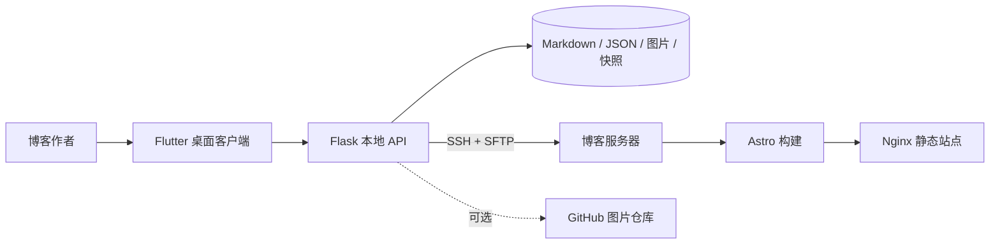

# Wonelog

一个由 **Astro 静态博客、Flutter Windows 桌面客户端和 Flask 发布服务**组成的自托管博客系统。

Wonelog 面向希望保留 Markdown 文件所有权、又不想每天手动执行构建和上传命令的个人博客作者。文章、配置、图片和快照保存在自己的设备与服务器中，桌面客户端负责日常管理，Astro 负责生成快速的静态站点。

## 核心能力

- Markdown 文章导入、拖放、编辑与发布
- 标题、摘要、标签、正文和封面管理
- 正文图片与封面图片统一上传到服务器图库
- 个人资料、头像、关于页面和页脚配置
- 城市足迹、经纬度、评价和旅行专题入口
- 友链、头像和项目展示管理
- 发布快照、指定版本发布与快照删除
- SSH 远程构建与静态文件部署
- 可选 GitHub 仓库图库
- Flutter Windows 原生桌面体验

## 系统架构



## 目录结构

```text
apps/blog/       Astro 静态博客
apps/desktop/    Flutter Windows 客户端
apps/server/     Flask API、发布与图库核心
data/            示例数据与持久化目录
deploy/          Docker 与发布配置
docs/            架构、配置、使用和安全文档
```

## 快速体验

### 1. 准备配置

```powershell
Copy-Item .env.example .env
```

只体验管理与预览功能时，可以暂时不填写 SSH 和 GitHub 配置。

### 2. 启动管理服务

```powershell
cd apps/server
python -m venv .venv
.\.venv\Scripts\Activate.ps1
pip install -r requirements.txt
python start_admin.py
```

服务地址为 `http://127.0.0.1:5000`，健康检查为 `/api/health`。

也可以从仓库根目录启动 Docker 版本：

```bash
docker compose up --build
```

### 3. 启动博客

```bash
cd apps/blog
pnpm install
pnpm dev
```

### 4. 启动桌面客户端

```powershell
cd apps/desktop
flutter pub get
flutter run -d windows
```

## 首次发布

1. 在服务器安装 Node.js 22、npm、rsync 和 Nginx。
2. 为部署用户配置 SSH 公钥和博客目录写入权限。
3. 在 `.env` 填写 `WONELOG_SERVER_*` 参数。
4. 先在客户端创建快照，再执行发布。
5. 确认站点正常后再配置域名和 HTTPS。

详细步骤参见 [部署文档](docs/DEPLOYMENT.md) 与 [配置参考](docs/CONFIGURATION.md)。

## 文档

- [用户指南](docs/USER_GUIDE.md)
- [系统架构](docs/ARCHITECTURE.md)
- [配置参考](docs/CONFIGURATION.md)
- [部署说明](docs/DEPLOYMENT.md)
- [安全说明](docs/SECURITY.md)
- [开发路线](docs/ROADMAP.md)
- [参与贡献](CONTRIBUTING.md)

## 隐私与数据所有权

开源仓库只包含空白配置和示例文章，不包含作者的服务器 IP、私钥、Token、邮箱、备案号、真实文章、图片、城市足迹、友链或历史快照。请同样避免把自己的 `.env`、`secrets/` 与 `data/versions/` 提交到公开仓库。

## License

Wonelog 使用 [GNU Affero General Public License v3.0](LICENSE)。部署并向网络用户提供修改版服务时，需要依照许可证提供对应源码。