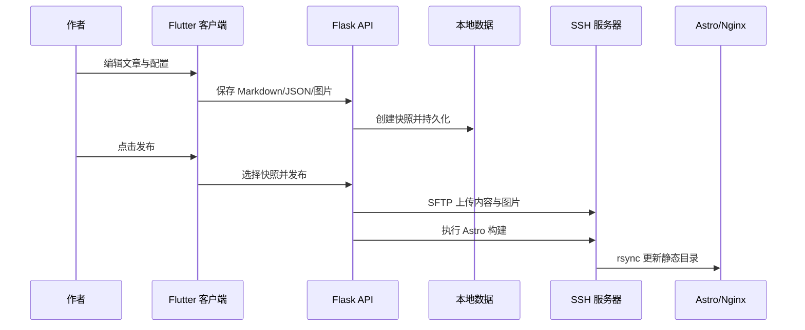

# 系统架构

## 设计目标

Wonelog 将内容管理、站点生成和线上服务分开：管理服务只在本地运行，线上服务器只提供静态页面，从而降低公网攻击面并保持页面访问速度。

## 组件

### Flutter 桌面客户端

负责总览、文章编辑、Markdown 拖放、图片预览、城市、友链、项目、快照和发布控制。客户端默认连接 `http://127.0.0.1:5000`。

### Flask 发布服务

负责读写本地 JSON、Markdown 和图片，管理版本快照，并通过 SSH/SFTP 将数据同步到服务器。发布服务不应直接暴露到公网。

### Astro 博客

构建时读取 `src/content` 中的文章和 JSON 数据，生成纯静态 HTML。Nginx 只负责静态文件，不参与后台管理。

## 数据流

## 数据目录

- `posts/`：Markdown 文章
- `images/`：头像、封面与正文图片
- `versions/`：发布快照
- `config.json`：站点和个人资料
- `cities.json`：城市足迹
- `links.json`：友链
- `projects.json`：项目展示
- `about_content.json`：关于页模块

## 安全边界

客户端和 API 运行在作者设备上；服务器仅接受部署用户的 SSH 连接；访客只能访问构建后的静态页面。图库 Token 与 SSH 私钥通过环境变量和本地文件提供，不写入源码。